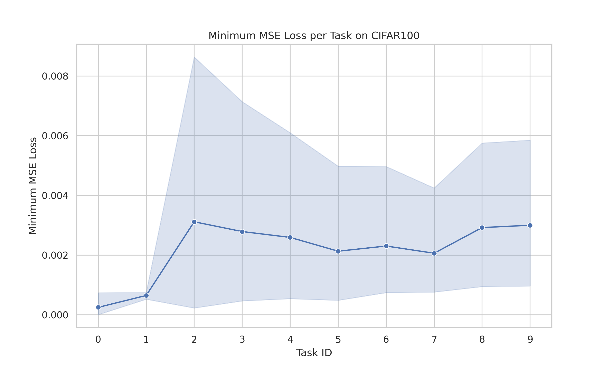
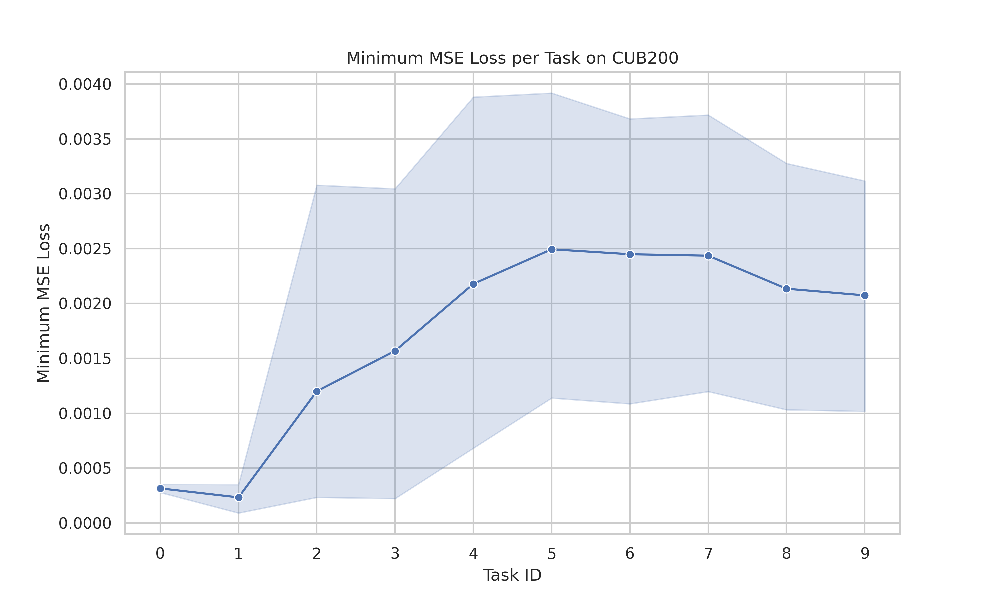
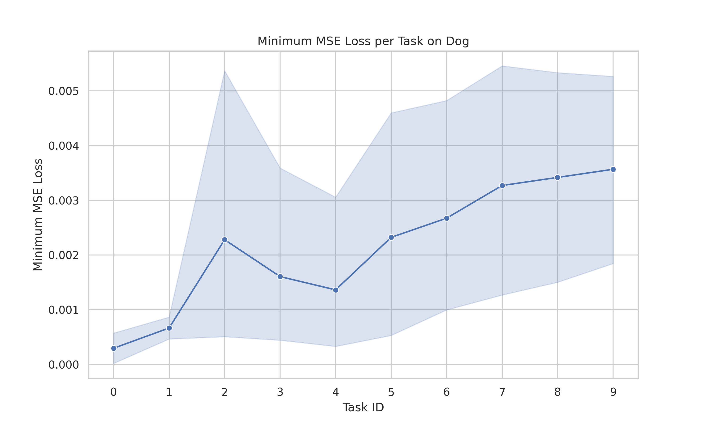
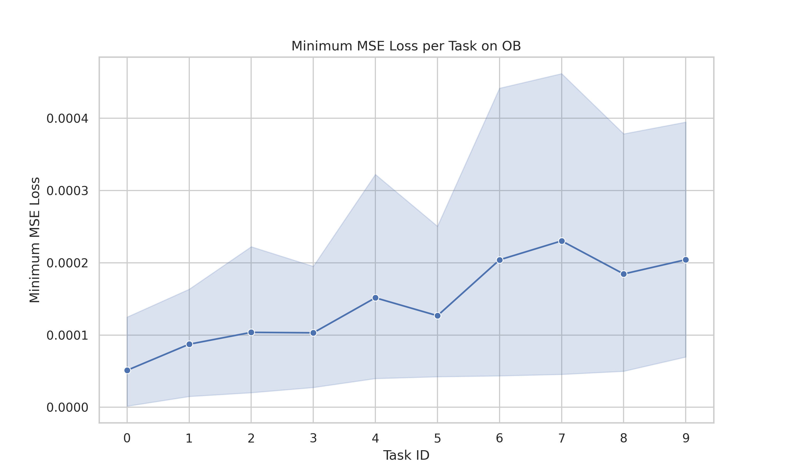

This codebase contains the Jittor implementation of ***Order-Robust Class Incremental Learning: Graph-Driven Dynamic Similarity Grouping***, achieving alignment between experiments and performance.

## Requirements

- Python >= 3.9
- a **CUDA** toolkit
- a **C** compiler (compatible with CUDA)

The system and hardware I used and tested in:

- Ubuntu 22.04
- 20 vCPU AMD EPYC 7642 48-Core Processor
- Nvidia RTX 3090 (24GB)

## Environment setup

You need to have the development headers of Python installed (Jittor uses the python-config) and make sure that the python-config binary file is in the `path/to/your/venv/bin`.

```bash
pip install -r requirements.txt
```
Then run following command to test your Jittor dependencies:

```bash
python -m jittor.test.test_example
```
This command will automatically install the latest CUDA toolkit that is compatible with your CUDA driver.

If you encounter any errors, you may need to adjust the version of your C compiler to match that of your CUDA toolkit, in order to avoid conflicts with new features.

If you already have the CUDA toolkit installed, set the environment variables manually.

```bash
# If other compiler is used, change cc_path
export cc_path="clang++-8"
# Replace this var with your nvcc location
export nvcc_path="/usr/local/cuda/bin/nvcc" 
```

## Dataset preparation

You can manually download datasets as follows and move them to `./data/`:

- *CIFAR100*: will be automatically downloaded by the code.
- *CUB200*: Google Drive: [link](https://drive.google.com/file/d/1XbUpnWpJPnItt5zQ6sHJnsjPncnNLvWb/view?usp=sharing) or Onedrive: [link](https://entuedu-my.sharepoint.com/:u:/g/personal/n2207876b_e_ntu_edu_sg/EVV4pT9VJ9pBrVs2x0lcwd0BlVQCtSrdbLVfhuajMry-lA?e=L6Wjsc) (CAPTCHA needed)
- *Stanford Dogs*: will be automatically downloaded by the code.
- *OmniBenchmark*: Google Drive: [link](https://drive.google.com/file/d/1AbCP3zBMtv_TDXJypOCnOgX8hJmvJm3u/view?usp=sharing) or Onedrive: [link](https://entuedu-my.sharepoint.com/:u:/g/personal/n2207876b_e_ntu_edu_sg/EcoUATKl24JFo3jBMnTV2WcBwkuyBH0TmCAy6Lml1gOHJA?e=eCNcoA) (CAPTCHA needed)


## Pre-trained model

I used [ViT.jittor](https://github.com/li-xl/ViT.jittor) (reproduced from [timm](https://github.com/huggingface/pytorch-image-models)) as the structure of the Vision Transformer. I downloaded the model weights file from the url in timm and converted it using `convert_weights.py`.

Please ensure that you place the converted weights file in the `./models` and modify the url in the `./vit/config.py`.


## Training & Evaluation

Run the following command to train and evaluate the specified dataset:

```bash
# python main.py -d 'dataset_name'. For example, CIFAR100 dataset.
python main.py -d cifar224
```
Or run the following script to perform training and evaluation on the four datasets simultaneously:

```bash
./run.sh
```
You can modify the parameters in `dataset_name_publish.csv` where *dataset_name* is the name of the specified dataset.

## Results

### Table 1. Average final accuracy $A_N(\uparrow)$ on four datasets.

| Frame | CIFAR100 | CUB200 | Dog | OB |
|:-:|:-:|:-:|:-:|:-:|
|Jittor(*this repo*)| 92.66 ± 0.22 | 91.08 ± 1.91 | 93.33 ± 1.08 | 86.57 ± 0.51 |
|PyTorch(*upstream*)| 94.00 ± 0.03 | 91.64 ± 1.86 | 92.64 ± 0.48 | 87.33 ± 0.32 |

### Table 2. Performance drop $F_N(\downarrow)$ on four datasets.

| Frame | CIFAR100 | CUB200 | Dog | OB |
|:-:|:-:|:-:|:-:|:-:|
|Jittor(*this repo*)| 2.04 ± 0.59 | 0.48 ± 3.76 | 1.31 ± 0.45 | 1.25 ± 0.52 |
|PyTorch(*upstream*)| 0.78 ± 0.09 | 1.92 ± 1.29 | 1.42 ± 0.08 | 0.96 ± 0.16 |

### Table 3. Runtime usage $T_N$ on four datasets.

| Frame | CIFAR100 | CUB200 | Dog | OB |
|:-:|:-:|:-:|:-:|:-:|
|Jittor(*this repo*)| 4029.26s (***-33.65%***) | 1312.94s (***-72.07%***) | 1979.91s (***-45.01%***) | 8023.46s (***-47.99%***) |
|PyTorch(*upstream*)| 6072.44s | 4701.29s | 3600.76s | 15426.57s |

### Figure 1. Minimum MSE Loss per task on four datasets.
<table>
  <tr>
    <td align="center">CIFAR100</td>
    <td align="center">CUB200</td>
  </tr>
  <tr>
    <td></td>
    <td></td>
  </tr>
  <tr>
    <td align="center">Dog</td>
    <td align="center">OB</td>
  </tr>
  <tr>
    <td></td>
    <td></td>
  </tr>
</table>

> [!NOTE]
> For more details on the experiments, please refer to the [logs](./logs/logs_jittor/ncm).

## Conclusion

This repository has aligned the experimental results of the PyTorch and Jittor frameworks through experimentation and compared them with the results in the paper. Based on the experimental results, Jittor can reproduce PyTorch's experimental results well while improving the computing speed by nearly **50%**.

In fact, there are other points to note in the experiment：

1. PyTorch uses `def forward()` for forward propagation while Jittor uses `def execute()`.
2. The implementation and underlying logic of many functions in Jittor differ from those in PyTorch. For example, using the `eval()` function will force all gradient updates to stop, but PyTorch will not.
3. Jittor will place all `jt.Var` type variables on GPU if `jt.flags.use_cuda` is set to 1. In this case, you may need to  administer the GPU memory usage manually by deleting intermediate variables on time, and running `jt.sync_all()` and `jt.gc()`.
4. Jittor and PyTorch have different implementations of operators, and random seed generation also differs, so experiments are bound to produce errors. At the same time, Jittor's simplified implementation of ViT will also produce some errors.
