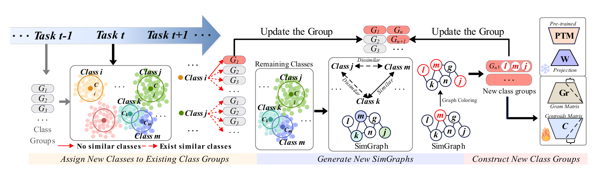
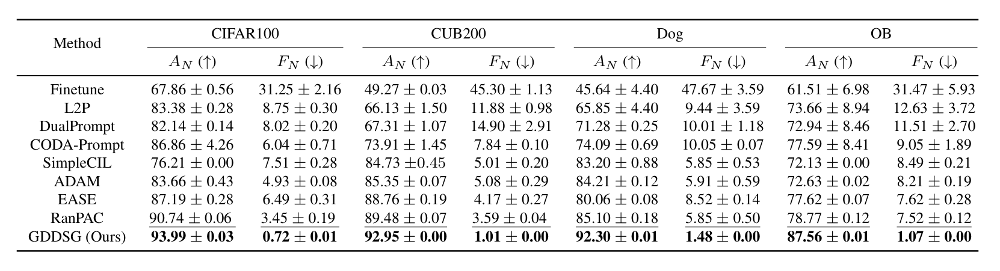

# Order-Robust Class Incremental Learning: Graph-Driven Dynamic Similarity Grouping

<div align="center">

<div>
  <a href='https://aignlai.github.io/' target='_blank'>Guannan Lai</a><sup>1</sup>&emsp;
  <a href='https://scholar.google.com/citations?user=P42FoNwAAAAJ&hl=zh-TW&oi=sra' target='_blank'>Yujie Li</a><sup>1,2</sup>&emsp;
  <a href='https://scholar.google.com/citations?user=L7AIhMkAAAAJ&hl=zh-CN' target='_blank'>Xiangkun Wang</a><sup>1</sup>&emsp;
  <a href='https://scholar.google.com/citations?hl=zh-CN&user=sQpMBqsAAAAJ' target='_blank'>Junbo Zhang</a><sup>3</sup>&emsp;
  <a href='https://scholar.google.com/citations?user=eLsZxC4AAAAJ' target='_blank'>Tianrui Li</a><sup>4</sup>&emsp;
  <a href='https://scholar.google.com/citations?hl=zh-CN&user=DCX8lbsAAAAJ&view_op=list_works&sortby=pubdate' target='_blank'>Xin Yang</a><sup>1</sup>&emsp;
</div>
<div>

  <sup>1</sup>School of Computer and Artificial Intelligence, Southwestern University of Finance and Economics &emsp;
  <sup>2</sup>The Leiden Institute of Advanced Computer Science (LIACS), Leiden University&emsp;
  <sup>3</sup>JD Intelligent Cities Research &emsp;
  <sup>4</sup>School of Computing and Artificial Intelligence, Southwest Jiaotong University

</div>
</div>

<p align="center">
  For inquiries, please contact: <a href="mailto:aignlai@163.com">aignlai@163.com</a>
</p>


🎉The code repository for "Order-Robust Class Incremental Learning: Graph-Driven Dynamic Similarity Grouping" (CVPR 2025) in PyTorch. If you use any content of this repo for your work, please cite the following bib entry:

```
@inproceedings{lai2024order, 
    title={Order-Robust Class Incremental Learning: Graph-Driven Dynamic Similarity Grouping}, 
    author={Lai, Guannan and Li, Yujie and Wang, Xiangkun and Zhang, Junbo and Li, Tianrui and Yang, Xin}, 
    booktitle={CVPR}, 
    year={2025} 
}
```

## Overview

This paper proposes a method called **GDDSG (Graph-Driven Dynamic Similarity Grouping)** to address the issues of **class order sensitivity** and **intra-task class conflicts** in **Class Incremental Learning (CIL)**. The core idea is to reduce the impact of class order on model performance and to mitigate confusion caused by similar classes within the same task. Through theoretical analysis, we demonstrate that reducing inter-class similarity can enhance model robustness by increasing the differences between optimal parameters across tasks. The GDDSG method employs a graph-based approach, where a similarity graph is constructed using the Welsh-Powell algorithm to group dissimilar classes together. Independent classifiers are then trained for each group, and the results are combined for predictions. Additionally, an incremental updating mechanism ensures that class groups are dynamically adjusted as new tasks arrive, optimizing the feature space and improving the model’s ability to handle class conflicts and forgetfulness.



## 🎊 Results

We conducted experiments on four datasets to verify the competitive performance of GDDSG.



## Environment Setup

This repository has been tested in an Anaconda environment. To replicate the environment precisely, please follow the instructions below:

```bash
conda create -y -n GDDSG python=3.9
conda activate GDDSG
conda install -y pytorch==1.13.1 torchvision==0.14.1 torchaudio==0.13.1 pytorch-cuda=11.7 -c pytorch -c nvidia
conda install -y -c anaconda pandas==1.5.2
pip install tqdm==4.65.0 
pip install timm==0.6.12
pip install easydict scikit-learn lightgbm imbalanced-learn optuna
```

## Reproducing the Results

To reproduce the results from the paper, execute the following commands:

```bash
python main.py -d 'datasetname'
```

